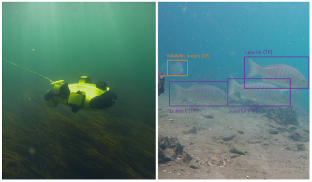

[![CC BY 4.0][cc-by-shield]][cc-by]
[![DOI][doi-shield]][doi-url]

[cc-by]: http://creativecommons.org/licenses/by/4.0/
[cc-by-shield]: https://img.shields.io/badge/License-CC%20BY%204.0-lightgrey.svg
[doi-shield]: https://img.shields.io/badge/PLACE-HOLDER-blue
[doi-url]: https://doi.org/

Deep learning training configuration files for "**Fish surveys on the move: automated fish counts from mobile cameras**"
============

## Overview

This repository contains the configurations files for the three frameworks used in the manuscript [Fish surveys on the move: automated fish counts from mobile cameras]() by Connolly et al 2022.

## Configuration files

- [Detectron](/data/configs/detectron/detectron.yaml)

- [Detectron2](/data/configs/detectron2/detectron2.yaml)

- [YOLOv5](/data/configs/yolov5)
